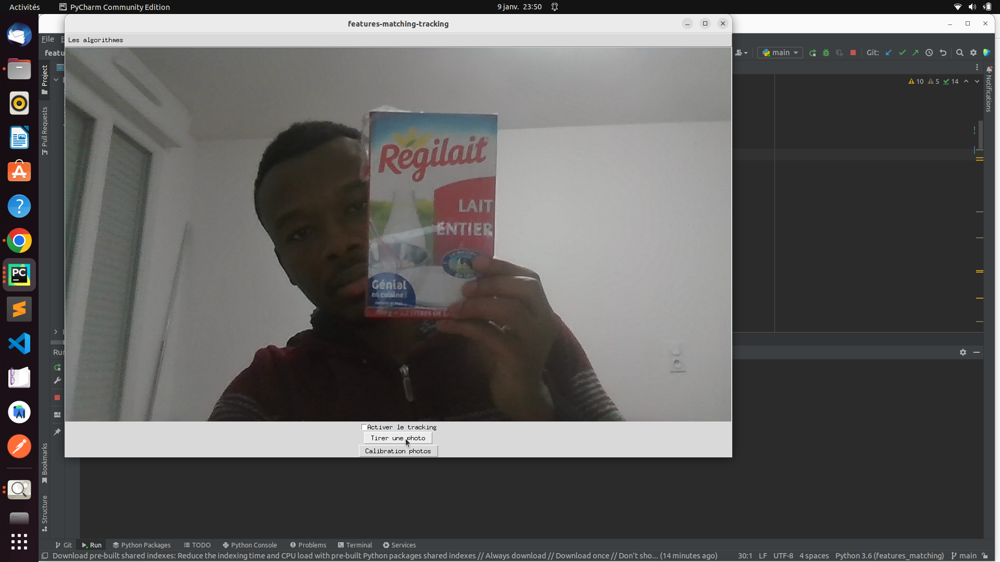
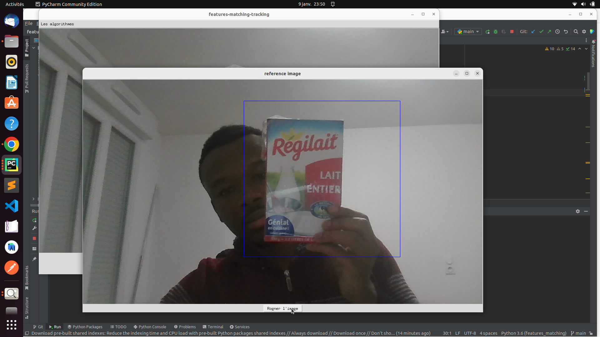
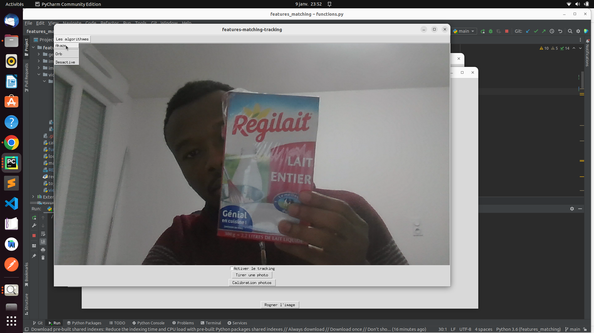

# Features-matching to track object

## Working principle of the features-matching algorithm

When you observe an object, you can recognize it in different contexts and different photos where the object is present. This means that in different images,
different photos of an object some things don't change otherwise you would not be able to recognize it. The goal of the
**[features matching](https://opencv24-python-tutorials.readthedocs.io/en/latest/py_tutorials/py_feature2d/py_matcher/py_matcher.html)** 
algorithm is to find the aspects, the pixels of the image which do not change, describe them and compare them with other images which show the same object. 
The name of these pixels are **keypoints**.

Thereby the **[features matching](https://opencv24-python-tutorials.readthedocs.io/en/latest/py_tutorials/py_feature2d/py_matcher/py_matcher.html)** 
algorithms proceed in three steps : the **detection**, the **description** and the **matching** of **keypoints**.

<ins>**important note**</ins>

As we said, the feature matching algorithm can detect image pixels that do not change, precisely those pixels that are robust to photometric,
scale, rotation, ... changes. But it may be that the number of pixels found is not sufficient to reconstruct the object. therefore we will look for at 
least four pixels, three of which are not aligned, which correspond between the two images. Then from these four pixels we are going to deduce 
the [homography](https://en.wikipedia.org/wiki/Homography_(computer_vision)) which makes it possible to pass from one image to another. If there is a 
[homography](https://en.wikipedia.org/wiki/Homography_(computer_vision)) we can say that the two images correspond. 
**Thus, from the correspondence between pixels we pass to the correspondence between images**. In this code we used two features-matching algorithms: 
[AKAZE](http://tulipp.eu/wp-content/uploads/2019/03/2017_TUD_HEART_kalms.pdf) and [ORB](http://www.gwylab.com/download/ORB_2012.pdf)

## The packages needed to use the algorithm

* Install : **Python 3.6.13** (It is recommended to create a virtual environment. If you are used to using Pycharm or Anaconda it will be easy.)
* Install requirement.txt file : **pip3 install -r requirements.txt**

## Idea behind this code

In this algorithm, we want to use a features-matching algorithm to track an object. Usually in features-matching algorithms one takes a reference image
that the algorithm must find, but this reference image does not change. In object tracking, the object can be in motion and the goal is to track it as 
it moves. **The idea behind this algorithm is to change the reference image by a part of a new image each time the object is detected in this image**. 
The advantage of this method is that the features-matching algorithm can adapt to the change that the object undergoes during its movement. 

https://user-images.githubusercontent.com/82286853/211151063-e3463188-65c2-470c-b14c-2277d8bbd817.mp4

**The main difficulty is to find a good criterion to know when the object is detected**. As we said, the feature matching algorithm can match images using homography. 
But, this method can be problematic because the homography found does not always include the object to be searched. And if you want to constantly change the reference 
image with a new image of the object, you have to know where it is. By exemple in this image : 
  

Homography in **red** is detected but does not contain the image. **Thus, we select the homographies, and retain those which have a shape close to the rectangle and whose surface is greater than that of the reference image.** In this code when the homography respects this condition it is in **green**

## how to use this code ?

* **Step 1** : Take a capture with the object you want to track.

 
 
* **Step 2** : Crop object in image.

 
 
* **Step 3** : Choose an algorithm

 
 
* **Step 4** : Activate the tracking algorithm.

 
