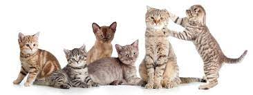

# Features-matching

## Principe de fonctionnement du features-matching

Les algorithmes de **features-matching** procèdent en trois étapes : la **détection des points-clés**, la **description** et le **match**.

**La détection des points-clés**

Lorsqu'un humain observe  quelque chose (un visage, un animal, un objet...) il arrive à reconnaître l'objet dans différents contextes ou différentes scènes. Par exemple, en dépit du fait que les contextes sont différents on arrive à reconnaitre dans les images suivantes la présence de chats:

Cela suggère qu'en dépit de certains changements(scènes, photométriques, géométriques ...) que peut subir un objet d'une image à l'autre, on est en mesure de le reconnaître indépendamment de ces changements. Ainsi un certain nombre d'informations visuelles sur cet objet sont suffisantes pour le caractériser. Et c'est de là que vient le concept de points-clés. Ce sont les endroits de l'objet qui sont invariants lorsqu'on passe d'une image à l'autre image. Et donc sont suffisants pour le caractériser. La détection de points-clés consiste à trouver ces points-clés.

**Nous l'appliquons pour la détection et la distinction de chiens suivant leurs races et etayons chacunes de ses étapes dans le notebook**
